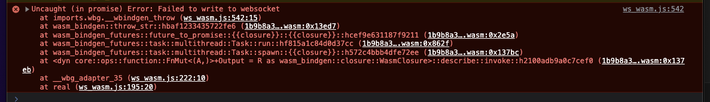

# test-ws-stream-wasm

This is a reproduction for `ws-stream-wasm` failing with nightly and rust rustflags `+atomics,+bulk-memory,+mutable-globals`.

## Issue

With the settings above, when trying to write to a websocket (`io_stream`),

```bash
    let ws_server_url = "ws://localhost:12345";
    let (mut ws_meta, mut ws_stream) = WsMeta::connect(ws_server_url, None ).await
        .expect_throw( "assume the client ws connection succeeds" );
    let mut io_stream = ws_stream.into_io();
    let message         = b"Hello from browser".to_vec();
	io_stream
        .write(&message).await
        .expect_throw( "Failed to write to websocket" );
```

it fails with the error message "Error: Failed to write to websocket".

My environment:
- OS: macOS 12.6
- cargo: 1.68.0-nightly (70898e522 2022-12-05)
- rustc: 1.68.0-nightly (bdb07a8ec 2022-12-11)
- Chrome: Version 116.0.5845.140 (Official Build) (x86_64)

## Reproduction

### Step 1: Clone the repo
```bash
git clone git@github.com:mhchia/test-ws-stream-wasm.git
```

### Step 2: Install wasm-pack
```bash
yarn global add wasm-pack
```

### Step 3: Use nightly rust
Creating a file `rust-toolchain` with the content `nightly-2022-12-12` under this project root.
```bash
echo "nightly-2022-12-12" > rust-toolchain
```

### Step 4: Use rustflags `+atomics,+bulk-memory,+mutable-globals`

Add a file `.cargo/config` under this project root with the following content, as wasm-bindgen-rayon [suggested](https://github.com/GoogleChromeLabs/wasm-bindgen-rayon#using-config-files).

```bash
[target.wasm32-unknown-unknown]
rustflags = ["-C", "target-feature=+atomics,+bulk-memory,+mutable-globals"]

[unstable]
build-std = ["panic_abort", "std"]
```

### Step 5: Start a websocket server
Open a terminal and run the following commands to start a websocket server, which prints the messages received from the client.

```bash
cd ws-server
yarn install
yarn start
```

### Step 6: Build wasm and run a web server
Open another terminal and run

```bash
yarn build-and-start
```

Open the page `http://localhost:8080` in your browser. A websocket from `ws-stream-wasm` then try sending a message to the websocket server from Step 5. It should **fail** with the following error message.



### Step 7: Remove the file `.cargo/config` and try again
Remove the file `.cargo/config`, run `yarn build-and-start` again, and open the page `http://localhost:8080` in your browser. It should **succeed**, and you can see `Successfully sent message to server` in your browser console.
